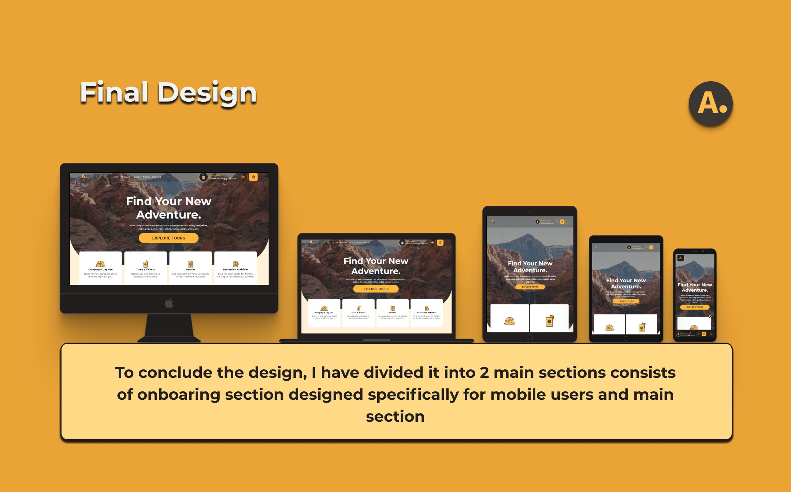

# iMart eCommerce Platform

<br />
<p align="center">
  <a href="https://aloha-travels-app.herokuapp.com/">
    
  </a>

  <h3 align="center">Aloha Travel | Tour Booking Webapp </h3>

  <p align="center">
Book exciting and adventurous tours. <br />
    <a href="m90khan@gmail.com"><strong>Contact Me</strong></a>
    <br />
    <br />
    <a href="https://aloha-travels-app.herokuapp.com/">View Demo</a>
    
   </p>
</p>

## Table of Contents

- [About the Project](#about-the-project)
- [Process](#process)
- [Skills](#skills)
- [Code Snipet](#code)
- [Connect with me](#Contact)

---

### About the Project

Aloha Travels wants to increase its sales. They want an online platform for the existing and new customers to be able to view and book tours online and reduce office visits to a minimum due to pandemic. The company wants to pivot to offer new travel experiences in remote locations instead of city tours.

Live: https://aloha-travels-app.herokuapp.com/



#### Process

For complete process, please click the link below for case study

Case Study: https://www.behance.net/gallery/113025531/Aloha-Travels-Part-One

---

### Skills

[][youtube]
[][youtube]
[][youtube]
[][youtube]
[][youtube]

[][youtube]
[][youtube]
[][youtube]
<br />
<br />

---

### Code Snippet

```javascript
const nodemailer = require('nodemailer');
const pug = require('pug');
const htmlToText = require('html-to-text');
module.exports = class Email {
  constructor(user, url) {
    this.sendTo = user.email;
    this.firstName = user.name.split(' ')[0];
    this.url = url;
    this.sendFrom = `Khan M <${process.env.EMAIL_FROM}>`;
  }

  newTransport() {
    if (process.env.NODE_ENV === 'production') {
      // send grid
      return nodemailer.createTransport({
        service: 'SendGrid',
        auth: {
          user: process.env.SENDGRID_USERNAME,
          pass: process.env.SENDGRID_PASSWORD
        }
      });
    }

    return nodemailer.createTransport({
      host: process.env.EMAIL_HOST,
      port: process.env.EMAIL_PORT,
      auth: {
        user: process.env.EMAIL_USERNAME,
        pass: process.env.EMAIL_PASSWORD
      }
    });
  }
  // send actual email

  async send(template, subject) {
    //1- render html based on pug template
    const html = pug.renderFile(
      `${__dirname}/../views/emails/${template}.pug`,
      {
        firstName: this.firstName,
        url: this.url,
        subject: subject
      }
    );
    //2- Define email options
    const mailOptions = {
      from: this.sendFrom,
      to: this.sendTo,
      subject: subject,
      html: html,
      text: htmlToText.fromString(html)
    };
    //3- create transport and send email
    await this.newTransport().sendMail(mailOptions);
  }
  async sendWelcome() {
    await this.send('welcome', 'Welcome to Aloha Travels!');
  }
  async sendPasswordResetNotice() {
    await this.send('welcome', 'Your Password has been reset!');
  }
  async sendPasswordReset() {
    await this.send(
      'passwordReset',
      'Your Password reset token (valid for 15 minutes)'
    );
  }
};
```

---

### Connect with me:

[][youtube]

[][twitter]
[][linkedin]
[][instagram]
[][behance]
[][dribble]
<br />

---

[youtube]: https://www.youtube.com/channel/UC96rVfdTKsjZpREnH6CaCOw
[twitter]: https://twitter.com/uxdkhan
[linkedin]: https://www.linkedin.com/in/uxdkhan
[instagram]: https://www.instagram.com/uxdkhan/
[behance]: https://www.behance.net/Khan_Mohsin
[dribble]: https://dribbble.com/uxdkhan
